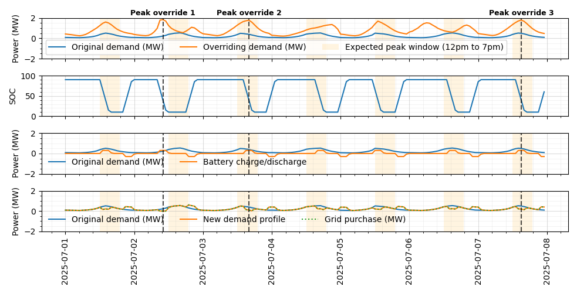
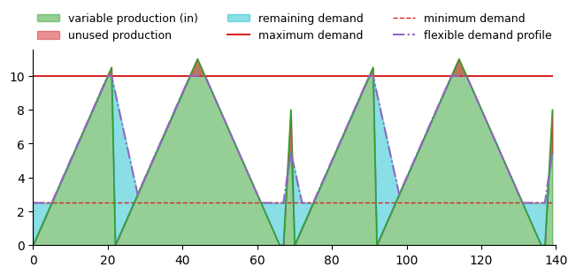

(open-loop-control)=
# Open-Loop Controllers

## Open-Loop Storage Controllers
The open-loop storage controllers can be attached as the control strategy in the `tech_config` for various storage converters (e.g., battery or hydrogen storage). There are three controller types for storage:
1. [Simple Open-Loop Storage Controller](#pass-through-controller) — passes the commodity flow to the output with only minimal or no modifications.
2. [Demand Open-Loop Storage Controller](#demand-open-loop-storage-controller) — uses simple logic to attempt to meet demand using the storage technology.
3. [Peak Load Management Open-Loop Storage Controller](#peak-load-management-open-loop-storage-controller) — computes a peak-shaving dispatch schedule to reduce demand peaks, supporting one or two demand profiles with configurable event limits and time windows.

(pass-through-controller)=
### Simple Open-Loop Storage Controller
The `SimpleStorageOpenLoopController` passes the input commodity flow to the output, possibly with minor adjustments to meet demand. It is useful for testing and as a placeholder for more complex controllers.

For examples of how to use the `SimpleStorageOpenLoopController` open-loop control framework, see the following:
- `examples/01_onshore_steel_mn`
- `examples/02_texas_ammonia`
- `examples/12_ammonia_synloop`

(demand-open-loop-storage-controller)=
### Demand Open-Loop Storage Controller
The `DemandOpenLoopStorageController` uses simple logic to dispatch the storage technology when demand is higher than commodity generation and charges the storage technology when the commodity generation exceeds demand, both cases depending on the storage technology's state of charge. For the `DemandOpenLoopStorageController`, the storage state of charge is an estimate in the control logic and is not informed in any way by the storage technology performance model.

An example of an N2 diagram for a system using the open-loop control framework for hydrogen storage and dispatch is shown below ([click here for an interactive version](./figures/open-loop-n2.html)). Note that the hydrogen out going into the finance model is coming from the control component.


For examples of how to use the `DemandOpenLoopStorageController` open-loop control framework, see the following:
- `examples/14_wind_hydrogen_dispatch/`
- `examples/19_simple_dispatch/`

(peak-load-management-open-loop-storage-controller)=
### Peak Load Management Open-Loop Storage Controller
The `PeakLoadManagementOpenLoopStorageController` computes and executes a peak-shaving dispatch schedule assuming perfect forecasting. It is designed for reducing peak loads, not meeting a specific demand, using either one or two loads for determining peaks.

The controller supports two demand profiles:

- **`demand_profile`** — the local or sub-system demand. Peaks within a configurable daily time window (`peak_range`) are identified as candidate discharge targets.
- **`demand_profile_2`** — an optional upstream or supervisory demand. When provided, an operator can override the local peak schedule up to a configurable number of events per period (e.g., three times per week). Peaks are determined as the highest n peaks in each period.

The `dispatch_priority_demand_profile` parameter selects which profile acts as the override schedule. On days where the priority profile flags a peak, the controller follows that schedule; on all other days it falls back to the other profile.

**Dispatch logic (state machine)**

1. **Discharge** — begins `advance_discharge_period` before the next scheduled peak and runs until `min_soc_fraction` is reached.
2. **Charge** — resumes after `delay_charge_period` has elapsed since the end of discharge, subject to the `allow_charge_in_peak_range` flag which can block recharging during the peak windows.
3. **Idle** — all other timesteps; set-point is zero.

An example output for the first week of a one-year simulation is shown below. Orange shading marks the 12:00–19:00 daily peak window. The top panel shows both demand profiles; the second panel shows battery state of charge; the third shows battery charge/discharge power; the fourth shows the resulting net demand.



For an example of how to use the `PeakLoadManagementOpenLoopStorageController`, see:
- `examples/33_peak_load_management/`

#### Configuration
The controller is defined within the `tech_config` and requires the shared storage parameters plus a `control_parameters` block:

**Storage system parameters used by the controller**

| Field | Type | Description |
| --- | --- | --- |
| `commodity` | `str` | Commodity name (e.g., `electricity`). |
| `commodity_rate_units` | `str` | Rate units (e.g., `kW`). |
| `demand_profile` | scalar or list | Local demand timeseries. |
| `max_capacity` | `float` | Storage capacity in commodity amount units. |
| `max_charge_rate` | `float` | Maximum charge rate. |
| `max_discharge_rate` | `float` | Maximum discharge rate (required if `charge_equals_discharge: false`). |
| `charge_equals_discharge` | `bool` | If `true`, discharge rate equals `max_charge_rate`. |
| `max_soc_fraction` | `float` | Upper SOC limit as a fraction (0–1). |
| `min_soc_fraction` | `float` | Lower SOC limit as a fraction (0–1). |
| `init_soc_fraction` | `float` | Initial SOC as a fraction (0–1). |
| `charge_efficiency` | `float` | Charging efficiency (0–1). |
| `discharge_efficiency` | `float` | Discharging efficiency (0–1). |

**Control-specific parameters**

| Field | Type | Description |
| --- | --- | --- |
| `demand_profile_2` | scalar, list, or `null` | Optional supervisory/upstream demand timeseries. |
| `dispatch_priority_demand_profile` | `str` | Which profile controls scheduling: `demand_profile` or `demand_profile_2`. |
| `n_override_events` | `int \| null` | Maximum supervisory dispatch events allowed per `override_events_period`. |
| `override_events_period` | `str \| null` | Pandas period alias for resetting the event counter (e.g., `W` for weekly, `M` for monthly). |
| `peak_range` | `dict` | Daily window for local peak detection. Keys `start` and `end` as `HH:MM:SS` strings. |
| `advance_discharge_period` | `dict` | Lead time before a peak to start discharging. Keys `units` (e.g., `h`) and `val`. |
| `delay_charge_period` | `dict` | Wait after discharge before recharging. Keys `units` and `val`. |
| `allow_charge_in_peak_range` | `bool` | If `false`, charging is blocked during `peak_range`. |
| `min_peak_proximity` | `dict` | Minimum separation between retained peak events. Keys `units` and `val`. |

```yaml
control_strategy:
  model: PeakLoadManagementOpenLoopStorageController
model_inputs:
  shared_parameters:
    commodity: electricity
    commodity_rate_units: kW
    max_charge_rate: 300.0
    max_capacity: 1200.0
    max_soc_fraction: 0.9
    min_soc_fraction: 0.1
    init_soc_fraction: 0.9
    demand_profile: !include demand_profile.yaml
    charge_efficiency: 1.0
    discharge_efficiency: 1.0
  control_parameters:
    max_discharge_rate: 300.0
    charge_equals_discharge: true
    demand_profile_2: !include demand_profile_2.yaml
    dispatch_priority_demand_profile: demand_profile_2
    n_override_events: 3
    override_events_period: W
    peak_range:
      start: "12:00:00"
      end: "19:00:00"
    advance_discharge_period:
      units: h
      val: 1
    delay_charge_period:
      units: h
      val: 4
    allow_charge_in_peak_range: false
    min_peak_proximity:
      units: h
      val: 4
```

## Open-Loop Converter Controllers

Open-loop converter controllers define rule-based logic for meeting commodity demand profiles without using dynamic system feedback. These controllers operate independently at each timestep.

This page documents two core controller types:
1. Demand Open-Loop Converter Controller — meets a fixed demand profile.
2. Flexible Demand Open-Loop Converter Controller — adjusts demand up or down within flexible bounds.

(demand-open-loop-converter-controller)=
### Demand Open-Loop Converter Controller
The `DemandOpenLoopConverterController` allocates commodity input to meet a defined demand profile. It does not contain energy storage logic, only **instantaneous** matching of supply and demand.

The controller computes each value per timestep:
- Unmet demand (non-zero when supply < demand, otherwise 0.)
- Unused commodity (non-zero when supply > demand, otherwise 0.)
- Delivered output (commodity supplied to demand sink)

This provides a simple baseline for understanding supply–demand balance before adding complex controls.

#### Configuration
The controller is defined within the `tech_config` and requires these inputs.

| Field             | Type           | Description                           |
| ----------------- | -------------- | ------------------------------------- |
| `commodity_name`  | `str`          | Commodity name (e.g., `"hydrogen"`).  |
| `commodity_units` | `str`          | Units (e.g., `"kg/h"`).               |
| `demand_profile`  | scalar or list | Timeseries demand or constant demand. |

```yaml
control_strategy:
    model: DemandOpenLoopConverterController
model_inputs:
  control_parameters:
    commodity_name: hydrogen
    commodity_units: kg/h
    demand_profile: [10, 10, 12, 15, 14]
```
For an example of how to use the `DemandOpenLoopConverterController` open-loop control framework, see the following:
- `examples/23_solar_wind_ng_demand`

(flexible-demand-open-loop-converter-controller)=
### Flexible Demand Open-Loop Converter Controller
The `FlexibleDemandOpenLoopConverterController` extends the fixed-demand controller by allowing the actual demand to flex up or down within defined bounds. This is useful for demand-side management scenarios where:
- Processes can defer demand (e.g., flexible industrial loads)
- The system requires demand elasticity without dynamic optimization

The controller computes:
- Flexible demand (clamped within allowable ranges)
- Unmet flexible demand
- Unused commodity
- Delivered output

Everything remains open-loop no storage, no intertemporal coupling.

For an example of how to use the `FlexibleDemandOpenLoopConverterController` open-loop control framework, see the following:
- `examples/23_solar_wind_ng_demand`

The flexible demand component takes an input commodity production profile, the maximum demand profile, and various constraints (listed below), and creates a "flexible demand profile" that follows the original input commodity production profile while satisfying varying constraint.
Please see the figure below for an example of how the flexible demand profile can vary from the original demand profile based on the input commodity production profile and the ramp rates.
The axes are unlabeled to allow for generalization to any commodity and unit type.

|  |
|-|


#### Configuration
The flexible demand controller is defined within the `tech_config` with the following parameters:

| Field               | Type           | Description                                  |
| ------------------- | -------------- | -------------------------------------------- |
| `commodity_name`          | `str`          | Commodity name.                              |
| `commodity_units`         | `str`          | Units for all values.                        |
| `demand_profile`          | scalar or list | Default (nominal) demand profile.            |
| `turndown_ratio`          | float          | Minimum fraction of baseline demand allowed. |
| `ramp_down_rate_fraction` | float          | Maximum ramp-down rate per timestep expressed as a fraction of baseline demand. |
| `ramp_up_rate_fraction` | float          | Maximum ramp-up rate per timestep expressed as a fraction of baseline demand. |
| `min_utilization` | float          | Minimum total fraction of baseline demand that must be met over the entire simulation. |

```yaml
model_inputs:
  control_parameters:
    commodity_name: hydrogen
    commodity_units: kg/h
    demand_profile: [10, 12, 10, 8]
    turndown_ratio: 0.1
    ramp_down_rate_fraction: 0.5
    ramp_up_rate_fraction: 0.5
    min_utilization: 0
```
