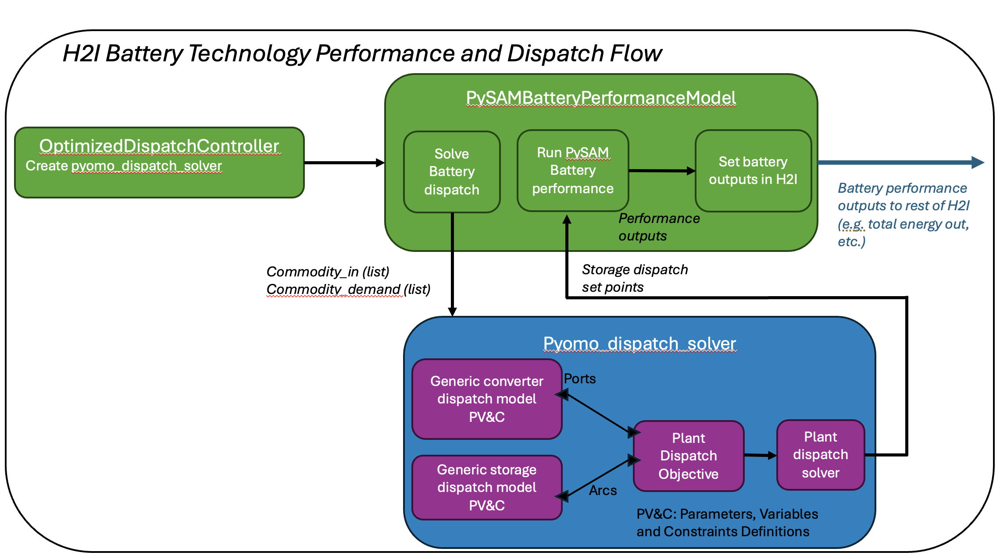

(pyomo-control)=
# Pyomo control framework
[Pyomo](https://www.pyomo.org/about) is an open-source optimization software package. It is used in H2Integrate to facilitate modeling and solving control problems, specifically to determine optimal dispatch strategies for dispatchable technologies.

Pyomo control allows for the possibility of feedback control at specified intervals, but can also be used for open-loop control if desired. In the pyomo control framework in H2Integrate, each technology can have control rules associated with them that are in turn passed to the pyomo control component, which is owned by the storage technology. The pyomo control component combines the technology rules into a single pyomo model, which is then passed to the storage technology performance model inside a callable dispatch function. The dispatch function also accepts a simulation method from the performance model and iterates between the pyomo model for dispatch commands and the performance simulation function to simulate performance with the specified commands. The dispatch function runs in specified time windows for dispatch and performance until the whole simulation time has been run.

An example of an N2 diagram for a system using the pyomo control framework for hydrogen storage and dispatch is shown below ([click here for an interactive version](./figures/pyomo-n2.html)). Note the control rules being passed to the dispatch component and the dispatch function, containing the full pyomo model, being passed to the performance model for the battery/storage technology. Another important thing to recognize, in contrast to the open-loop control framework, is that the storage technology outputs (commodity out, SOC, unused commodity, etc) are passed out of the performance model when using the Pyomo control framework rather than from the control component.


The pyomo control framework currently supports both a simple heuristic method and an optimized dispatch method for load following control.

(heuristic-load-following-controller)=
## Heuristic Load Following Controller

The simple heuristic method is specified by setting the storage control to  `HeuristicLoadFollowingController`. When using the pyomo framework, a `dispatch_rule_set` for each technology connected to the storage technology must also be specified. These will typically be `PyomoDispatchGenericConverter` for generating technologies, and `PyomoRuleStorageBaseclass` for storage technologies. More complex rule sets may be developed as needed.

For an example of how to use the heuristic pyomo control framework with the `HeuristicLoadFollowingController`, see
- `examples/18_pyomo_heuristic_wind_battery_dispatch`


(optimized-load-following-controller)=
## Optimized Load Following Controller
The optimized dispatch method is specified by setting the storage control to  `optimized_dispatch_controller`. The same `dispatch_rule_set` for each technology connected to the storage technology is followed as in the heuristic case, where each technology must also have a `dispatch_rule_set` defined in the `tech_config`. The optimized dispatch currently uses the same dispatch rules as the heuristic dispatch. This method maximizes the load met while minimizing the cost of the system (operating cost) over each specified time window.

The optimized dispatch using Pyomo is implemented differently than the heuristic dispatch in order to be able to properly aggregate the individual Pyomo technology models into a cohesive Pyomo plant model for the optimization solver. Practically, this means that the Pyomo elements of the dispatch (including the individual technology models and the plant model) are not exposed to the main H2I code flow, and do not appear in the N2 diagram. The figure below shows a flow diagram of how the dispatch is implemented. The green blocks below represent what is represented in the N2 diagram of the system. The dispatch routine is currently self-contained within the storage technology of the system, though it includes solving an aggregated plant model in the optimization (Note that only the PySAM battery performance model can call Pyomo dispatch at this time).



Within the `pyomo_dispatch_solver` routine, the Pyomo model is constructed and solved. To create the model, first the individual Pyomo technology models are created. Then, the Pyomo plant model is created to aggregate the individual modules. Each individual model defines parameters, variables and constratints for that technology. For storage technologies, storage-specific variables are defined (such as state of charge, etc.), as well as "system level" variables (such as the load demand signal, maximum system size, etc.). This is to enable the dispatch of systems without a grid-connection. These are not defined in the plant Pyomo model, because the plant Pyomo model only aggregates the existing technology models in order to enable a module definition of plants. The variables are connected between the individual and plant Pyomo models by defining endpoint ports for variable connections, and connecting these ports with Pyomo arcs. Once the Pyomo plant model is created, it is given to the solver and solved over the prediction horizon length (defaulting to 24 hours). The output of the dispatch solver is a list of storage technologies set points for the simulation duration that is passed to the storage performance model.

```{note}
We have exposed the optimization cost (weighting) values to the user in this implementation. This is good for visibility, but changing the cost values can change the behavior of the optimization. Some suggestions for setting weights:
- The `commodity_met_value` should be the largest (possibly by an order of magnitude) because this is what drives meeting the load for load following.
- The `cost_per_charge` value should not equal the `cost_per_discharge` value. If they are the same value, they can cause the optimizer to oscillate the battery. In general, `cost_per_charge` shoul be slightly lower than `cost_per_discharge`.
- The `cost_per_production` is the cost of the energy that is already produced (i.e. from wind for example). This can be set to 0 to encourage using incoming energy.
- The cost values are defined in units of "$/kW".
```

For an example of how to use the optimized pyomo control framework with the `optimized_dispatch_controller`, see
- `examples/27_pyomo_optimized_dispatch`


This controller only allows one incoming electricity stream and does not apply optimal dispatch of that stream back through the upstream technologies (no feedback). The dispatch can handle more than one generation technology, but the incoming electricity must be combined using an H2I combiner before going to the storage component, and the `cost_per_production`, which is defined in the storage technology section, needs to include the cost of production for all production technologies. This could be done using the following:

```python
technology_interconnections: [
  ["wind", "combiner", "electricity", "cable"],
  ["solar", "combiner", "electricity", "cable"],
  ["combiner", "battery", "electricity", "cable"],
]

tech_to_dispatch_connections: [
  ["combiner", "battery"],
  ["battery", "battery"],
```

The demand is also still set externally after the setup step. Ideally, the dispatch will be integrated with the load demand framework that already exists in H2I, and the demand can be defined that way.

```python
# Define demand signal
demand_profile = np.ones(8760) * 100.0

# Model setup
model.setup()
# Set demand signal directly on the battery technology
model.prob.set_val("battery.electricity_demand", demand_profile, units="MW")

# Run the model
model.run()
```
